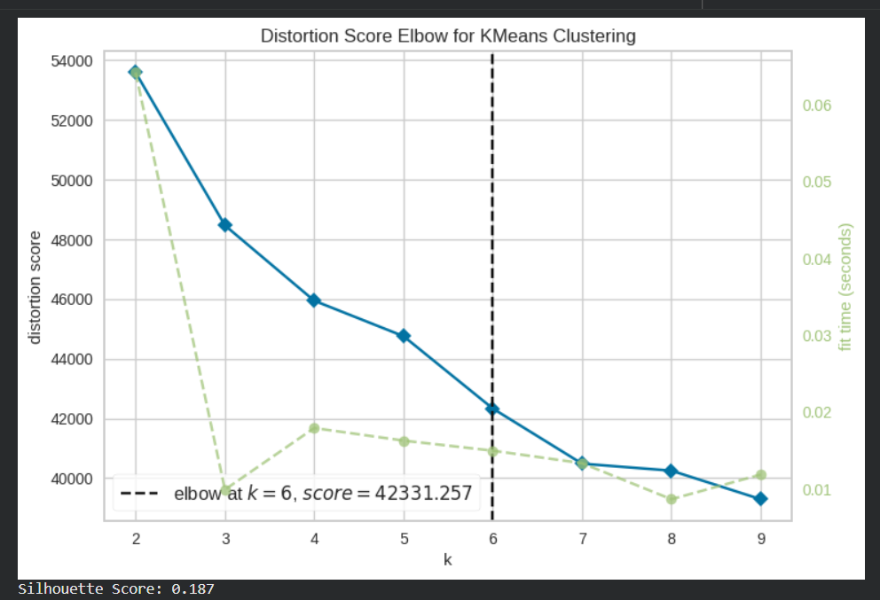
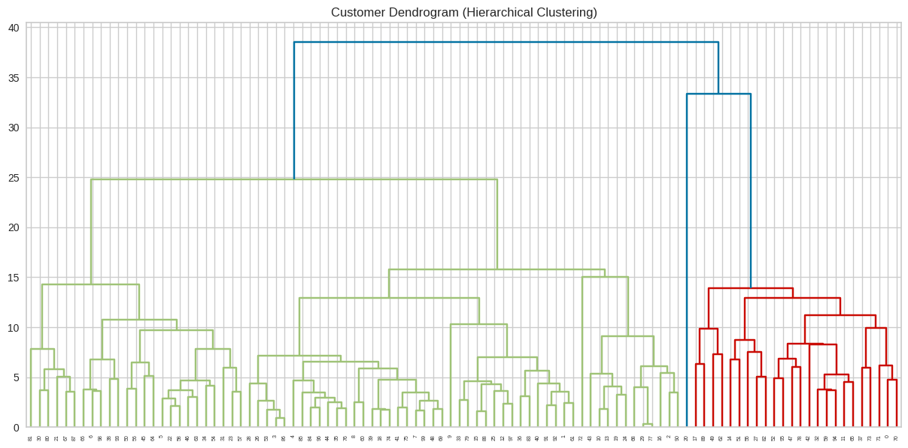
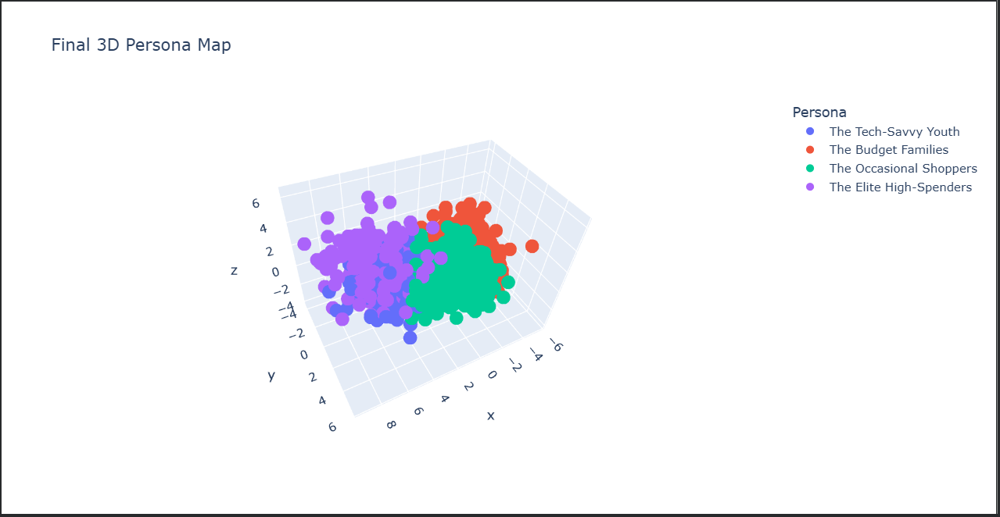
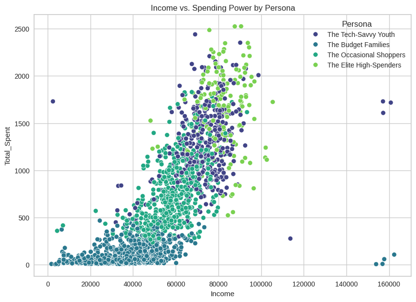

# 📊 Strategic Customer Behavioral Analysis
**An AI-Driven Study by Aditya, Sinchana, Nivetha, Pragya, & Priti**

**ABSTRACT**

This study presents a **Strategic Customer Behavioral Analysis** using unsupervised machine learning to move beyond traditional demographic segmentation. Utilizing a dataset of 2,240 customers, the research employs **Principal Component Analysis (PCA)** for dimensionality reduction and **K-Means Clustering** to identify latent consumer patterns.

Distinguishing this work from standard analytical models, we integrated a **"Human Angle"** by engineering features that measure the psychological tension between **Rational vs. Emotional spending, Digital Engagement,** and **Household Life-Stage Dynamics**. The model successfully identified four distinct strategic personas: *Elite High-Spenders, Budget-Conscious Families, Tech-Savvy Youth,* and *Occasional Shoppers*.

## 🎯 Project Overview
This project moves beyond traditional demographics to analyze the **psychology of consumer behavior**. By applying Unsupervised Machine Learning (K-Means Clustering) and Dimensionality Reduction (PCA), we segmented a customer base into four strategic personas to drive targeted marketing decisions.

## 🧠 The "Human Angle" (Our Strategic Corners)
Unlike standard data projects, our team focused on three specific behavioral indicators:
- **Rational vs. Emotional Spending:** We analyzed the balance between essential purchases (Meat/Fruits) and discretionary/luxury buys (Wine/Gold).
- **Digital Engagement:** We calculated a 'Digital Savvy Score' to identify customers who prefer web-based interactions over traditional physical stores.
- **Life-Stage Dynamics:** We integrated family size and parental status to understand how household pressure shifts spending priorities.

## 🛠️ Technical Implementation
- **Data Engineering:** Custom feature creation including `Total_Spent`, `Loyalty_Index`, and `Digital_Ratio`.
- **Dimensionality Reduction:** Used **PCA** to condense 29 variables into 3 Principal Components for optimized clustering.
- **Clustering Logic:** Applied **K-Means Clustering** with validation via the **Elbow Method** and **Silhouette Scoring**.
- **Visualization:** 3D Scatter Plots, Hierarchical Dendrograms, and Boxenplots for distribution analysis.
- ### 📐 Statistical Validation: The Elbow Method
To determine the optimal number of customer segments, we utilized the **KElbowVisualizer**. By plotting the "Distortion Score" against the number of clusters (K), we identified the **"Elbow Point" at K=4**. This mathematical inflection point ensures that our clusters are distinct enough to be meaningful without over-complicating the model.

## 📈 Visualizing the AI Insights

### 1. Model Validation: The Elbow Method & Dendrogram
*We utilized the Elbow Method and Hierarchical Dendrograms to analyze cluster stability. While the mathematical 'elbow' suggests 6 groups, we optimized the model to **4 Strategic Personas** to ensure maximum business interpretability and actionable marketing segments.*

### 2. Behavioral Mapping (3D PCA View)
*By reducing 29 variables into 3 Principal Components (PCA), we can visualize how our 2,240 customers naturally separate into distinct psychological groups.*

### 3. Income vs. Spending Power
*This distribution highlights the clear financial boundaries between our 'Elite Spenders' and 'Budget-Conscious' segments.*

---

## 💎 Unique Selling Point (USP)
> **Psychographic vs. Demographic Segmentation**
> Most traditional analyses cluster customers by simple metrics like Age or Income. Our project’s USP is the integration of **Psychographic Feature Engineering**. By isolating **"Emotional vs. Rational"** spending habits and calculating a **"Digital Savvy Ratio,"** we provide a behavioral roadmap that predicts *how* a customer shops, not just *who* they are.

## 🚀 Future Scopes
* **Predictive Churn Analysis:** Developing a supervised model to identify which "Occasional Shoppers" are at risk of leaving the brand.
* **A/B Strategy Testing:** Implementing personalized email triggers tailored specifically to the "Tech-Savvy Youth" persona.
* **Real-Time Deployment:** Building a Flask-based API to categorize new customers into these 4 personas instantly upon registration.
* **Sentiment Correlation:** Integrating social media feedback to see how public brand perception shifts across different clusters.

## 🏁 Conclusion
The transition from **Big Data to Smart Data** requires more than just algorithms; it requires human insight. Through the use of **PCA (Principal Component Analysis)** and **K-Means Clustering**, our team successfully reduced 29 complex variables into 4 actionable strategic personas. This study proves that a data-driven, persona-based marketing approach is essential for maximizing ROI and fostering long-term customer loyalty in a digital-first economy.

---

## 🚀 How to Run
The analysis is contained within the `.ipynb` file. It is optimized for **Google Colab** and requires the `marketing_campaign.csv` dataset provided in this repository.
